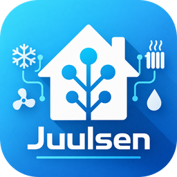
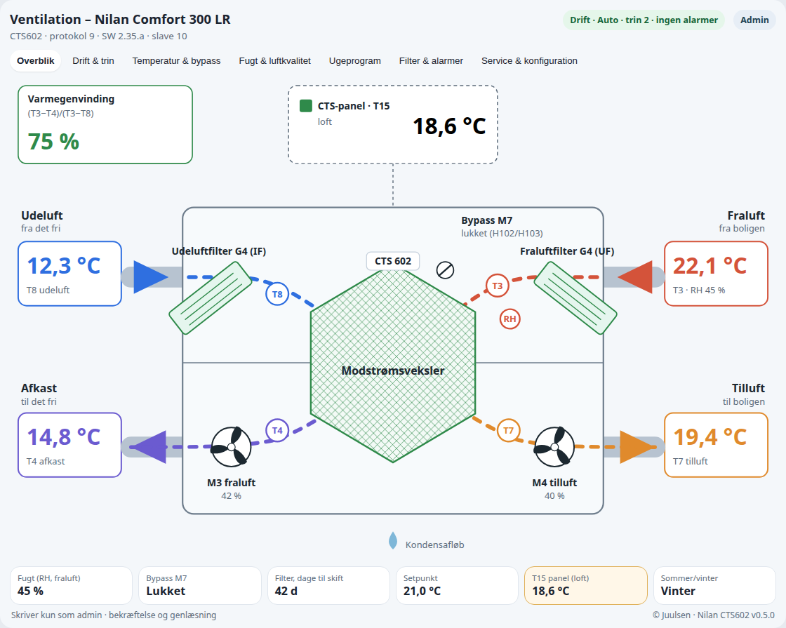
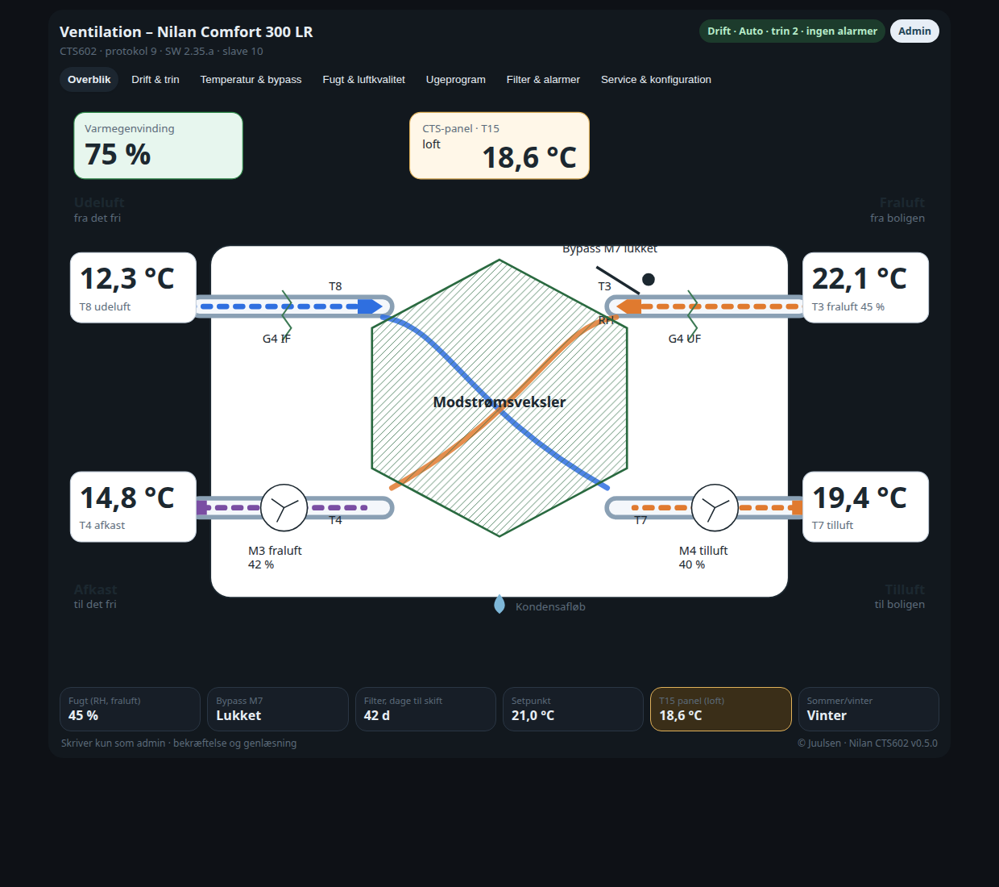
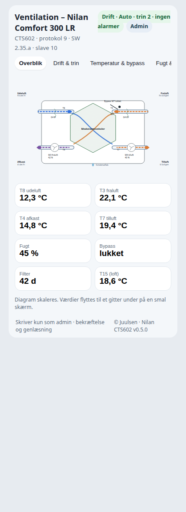
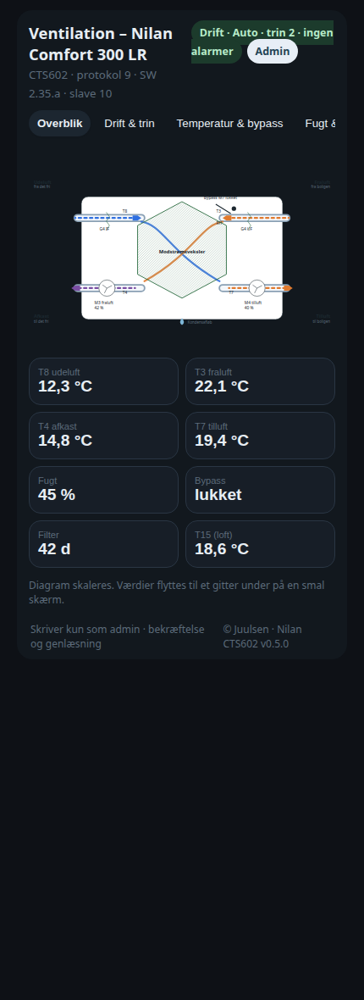

<p align="center">
  
</p>

# Nilan CTS602 · Juulsen

[](https://github.com/Juulsen/Nilan_cts602/releases/latest)
[](https://github.com/Juulsen/Nilan_cts602/actions/workflows/validate.yaml)
[](https://www.home-assistant.io/)
[](#installation)
[](#status-and-support)
[](#requirements)
[](#dashboard)
[](LICENSE)
[](https://www.paypal.me/MIJUTEC)

**Read and adjust a Nilan Comfort 300 LR with a CTS602 controller from Home Assistant, including the counterflow exchanger, filter life, alarms and confirmed settings.**

An independent community project by **Juulsen**, under active testing. Not developed, supported or endorsed by Nilan. Version 0.6.1 can write an allowlist of protocol 9 settings. Donations help support development and testing.

## Dansk

Nilan CTS602 læser og kan indstille et Nilan Comfort 300 LR med CTS602 fra Home Assistant. Overblikket er de medfølgende ventilationstegninger. Live værdier ligger i boksene på tegningen. Et smalt kort viser portrættegningen. Teksten er på dansk, når Home Assistant eller kortet er sat til dansk.

**Før du skifter:** slå den gamle `nilan`-integration (veista) fra, og fjern YAML-modbus-sensorer for samme slave. To integrationer på samme slave pumper den delte RS485-gateway.

Rumtemperaturen kan ikke skrives ind i regulatoren over Modbus. T15 er brugerpanelet. På det anlæg kortet er tegnet til sidder panelet på loftet ved aggregatet, så T15 er ikke stuetemperaturen. Vælg en temperaturentitet fra Home Assistant, hvis kortet skal vise rummet. Valget bruges kun til visning.

Efter installation sættes dashboard-ressourcen til:

```text
/nilan_cts602-static/nilan-card.js?v=0.6.1
```

Behold kun én Nilan-ressource. Anlægget gemmes under **Indstillinger → Enheder og tjenester → Nilan CTS602 → Konfigurer**. Guiden spørger, før den gemmer, og den skriver ikke til CTS602.

## Features

- **Allowlisted writes on protocol 9.** Function codes 03, 04 and 16 (one register, or six for the clock). Function code 06 is not used. Bus address, model type, service mode, factory reset, relay outputs, the keypress register and week-program erase stay forbidden.
- **Comfort only.** Setup reads model type, protocol and software. Anything other than Comfort (type 13) is refused with the type that answered.
- **Protocol gating.** Fan step, filter days and the bypass position register are read only when that protocol provides them.
- **Plant.** Electric preheater, electric or water reheater, option board, CO₂ and T10 create entities only when they are fitted. All of those options default to off. Electric and water reheater cannot both be on.
- **Heat recovery.** The primary sensor is the exhaust-side temperature efficiency. The controller's own value is a separate sensor.
- **Shared bus.** Requests for one gateway are serialized, with a pause between frames, retries and a 30 second default poll.
- **Dashboard card** with the counterflow overview, interactive history and the tabs Overview, Run & step, Temperature & bypass, Humidity & air quality, Week program, Filter & alarms, and Service & configuration.
- **Danish and English.**

See the [changelog](CHANGELOG.md).

## Requirements

- Home Assistant **2026.1.0 or newer**.
- A Nilan Comfort 300 LR with CTS602, reachable through a **Modbus TCP gateway**, a transparent RTU-over-TCP gateway, or a direct RS485 port at **19200 8E1**.
- Gateway host, TCP port and the CTS602 slave ID. The unit this integration is written for uses slave **10**. The PDF default of 30 is not assumed.
- If the same gateway already serves an ECL110, choose **Modbus TCP**. That is the framing the ECL110 integration uses.

The integration does not change the gateway's RS485 settings.

## Installation

### Through HACS

1. In HACS, open **⋮ → Custom repositories**.
2. Add `https://github.com/Juulsen/Nilan_cts602` with type **Integration**.
3. Find **Nilan CTS602 by Juulsen**, download it and restart Home Assistant.
4. Open **Settings → Devices & services → Add integration**, search for **Nilan CTS602**, and enter the connection.
5. Confirm preheater, reheater, CO₂, T10 and where the room temperature should come from.

### Manual installation

Download the source ZIP from the [latest release](https://github.com/Juulsen/Nilan_cts602/releases/latest). Extract it and copy the complete `custom_components/nilan_cts602` folder, including `frontend`, into `/config/custom_components/`. Restart Home Assistant, then add the integration as above.

### Migration

Disable every other reader of this slave before the first poll:

- The HACS integration **nilan** by veista, if it is installed.
- Any `modbus:` sensors in `configuration.yaml` that use the same gateway and slave.

Two masters on one RS485 gateway collide. This integration pauses between frames and retries, but it cannot share a lock with a different integration. Leave the old sensors disabled.

### Updating

Update through HACS, or replace the complete integration folder, then restart Home Assistant. On startup the integration rewrites an existing Nilan card resource to the URL below. Keep only one Nilan JavaScript resource and reload the browser.

## Dashboard

Add this dashboard resource as a **JavaScript module**:

```text
/nilan_cts602-static/nilan-card.js?v=0.6.1
```

Add a manual card:

```yaml
type: custom:nilan-cts602-card
language: da
```

One Comfort is discovered from its entities. With more than one unit, set `entity` to any of that unit's sensors. `view` is `graphic` or `fields`. The in-card **Grafisk / Felter** choice is stored in the browser.

```yaml
type: custom:nilan-cts602-card
entity: sensor.nilan_comfort_udeluft_t8
language: da
view: graphic
```

The tabs are **Overblik · Drift & trin · Temperatur & bypass · Fugt & luftkvalitet · Ugeprogram · Filter & alarmer · Service & konfiguration**. An administrator confirms every write. Other users see the values read-only.

`theme` is `light` (default), `dark` or `auto`. The default is the light card even when Home Assistant is dark. `auto` follows the Home Assistant theme. The ventilation drawing stays as supplied.

```yaml
type: custom:nilan-cts602-card
language: da
theme: light
```

The first time an administrator opens the card before a room entity is chosen, a banner starts the wizard. T0 is the sensor on the controller board. T10 is an external room sensor in an extract valve. T15 is the user panel; on this installation it sits in the loft, so it is not the living-room temperature. The controller cannot take an external sensor over Modbus.

### Version 0.5.0 card

Version 0.5.2 redraws this overview: the filters meet in an inverted V, and the flow lines, exchanger name and fan names are gone. The pictures below are the 0.5.0 drawing.

The overview is only the counterflow cross-section: outdoor air in at the top left, exhaust out at the bottom left, extract air in at the top right and supply air out at the bottom right. The exchanger is a hexagon spanning both ducts. The filters meet above it, and the fans and the bypass damper stay on the drawing. Tapping a value opens its history. On a narrow screen the drawing scales and the values move to a grid.









Every graph has a legend with the sensor name and the current value, for example `Ude 12,3 °C` when the language is Danish. A tap or hold shows every series at that time. The highest point on a graph is labelled. Decimal commas follow the language.

## Sensors

Temperatures are signed words scaled by 0.01 °C. T0, T3, T4, T7, T8 and T15 are created for a Comfort. T2, T9 and T10 stay disabled until a plausible probe was seen at setup, or until the plant says the sensor is fitted. An administrator can enable them from the device page.

| Reading | Notes |
| --- | --- |
| Duct and board temperatures | T0, T2, T3, T4, T7, T8, T9, T10, T15 |
| Humidity | Percent |
| CO₂ | Only when the plant says the sensor is fitted. Unit is ppm |
| Control state and operation mode | Text, not the raw number |
| Supply setpoint | Input 1201 |
| Supply and extract fan | Percent, plus step on protocol 9 and newer |
| Filter | Days since change and days left, protocol 9 and newer |
| Alarms | Count, plus alarm 1–3 with text. Date and time are decoded best-effort |
| Controller clock and panel display | Diagnostic |
| Room temperature | T15, T10, or another Home Assistant temperature entity. Display only |
| Heat recovery, exhaust side | `(T3 − T4) / (T3 − T8) × 100`, limited to 0–100. Unavailable when T3 − T8 is below 3 K |
| Heat recovery, controller | Input 1204, labelled as the controller's own value |

Binary sensors: running, summer, alarm active, filter, bypass, defrost, user function. Preheater and reheater are added only when configured.

The filter binary sensor follows alarm code 19 in the active alarm list, or zero days left before the filter change. The pressure-switch input is not used.

Bypass on protocol 10 and older follows the damper open and close relays. The position stays put while a relay is still moving, so the sensor does not flicker, and it stays unknown until a pulse has finished. Protocol 11 and newer use the bypass position register.

Current settings are `number`, `select` and `button` entities as well as the diagnostic sensors. Automations use the entities. The card writes through the same services.

## Connection defaults

| Setting | Default |
| --- | --- |
| Connection | Modbus TCP |
| Port | 502 |
| Slave ID | 10 |
| Poll | 30 seconds, minimum 10 |
| Pause between frames | 0.15 seconds, minimum 0.05 |
| Timeout | 5 seconds |
| Retries | 3, with backoff |

Serial is fixed at 19200 baud, 8 data bits, even parity, 1 stop bit, which is what the CTS602 uses.

## Status and support

0.6.1 writes an allowlist of protocol 9 settings with function code 16. The card asks an administrator to confirm, then the integration reads the register back. Experimental registers stay off until that option is enabled. On startup a stored plant at version 1 is migrated to version 2. A Home Assistant restart is required. After startup the integration rewrites an existing Nilan card resource to `/nilan_cts602-static/nilan-card.js?v=0.6.1`. Reload the browser so it fetches the new file.

Issues: <https://github.com/Juulsen/Nilan_cts602/issues>

These points are still assumptions until the live unit confirms them:

- Alarm date and time words use a best-effort bit layout. The raw words stay on the sensor if the date is not valid.
- Holding 1206 and 1207 (night-cooling limits) are scaled as 0.01 °C. The PDF does not state that scale. The sensors are marked `scale_assumed`.
- On protocol 9 the bypass position follows the last finished motor pulse. Holding 102 opens the damper and holding 103 closes it. The last position is restored after a restart and shown as last known until the next pulse. It stays unknown only when no pulse has been seen.
- The gateway address is never filled in for you. Modbus TCP is the default framing because that matches the shared ECL110 gateway.

## License

MIT © 2026 Juulsen
